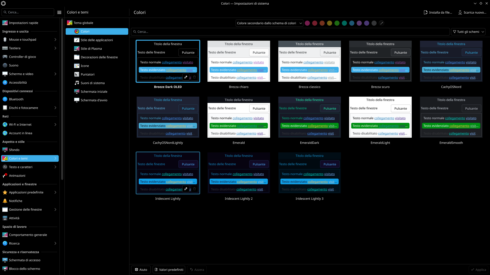

# Breeze Dark OLED

A variant of Breeze Dark optimized for OLED displays, with true black backgrounds for a cleaner look and reduced power consumption.

## Installation

### KDE Store

Open:

**System Settings → Colors & Themes → Colors**

Click **Install from File…** and select `BreezeDarkOLED.colors`.

## Upstream

Based on KDE Breeze Dark from the KDE Breeze project:

https://invent.kde.org/plasma/breeze

## License

This project is licensed under the **GNU Lesser General Public License, version 2.0 or later (LGPL-2.0-or-later)**.

See `LICENSE` for details.
